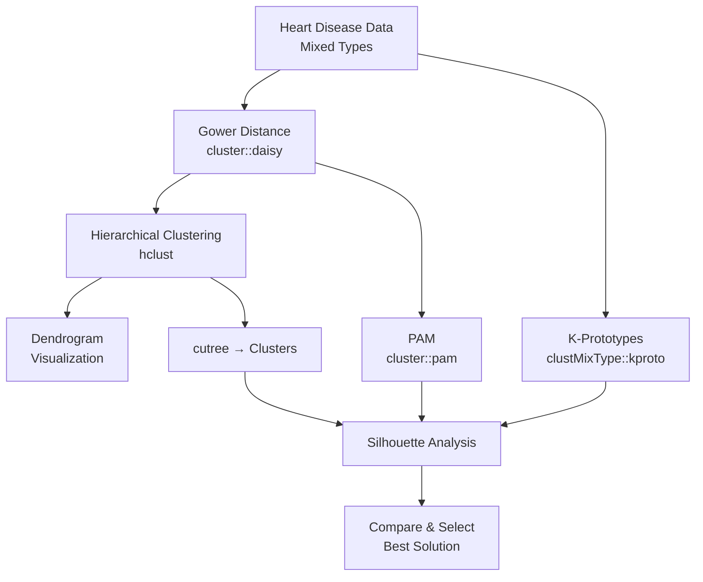

# Clustering Analysis Implementation Plan

## Overview

This document outlines the clustering analysis strategy for the Heart Disease dataset. The dataset contains **mixed data types** (6 quantitative variables and 8 categorical variables), which significantly influences our choice of distance metrics and clustering algorithms.

---

## Data Characteristics

| Type | Variables |
|------|-----------|
| **Quantitative** | `age`, `trestbps`, `chol`, `thalach`, `oldpeak`, `ca` |
| **Binary** | `sex`, `fbs`, `exang`, `disease` |
| **Categorical** | `cp`, `restecg`, `slope`, `thal`, `num` |

> [!IMPORTANT]
> The presence of mixed data types rules out standard Euclidean distance and K-means clustering, requiring specialized techniques designed for heterogeneous data.

---

## Proposed Analysis Pipeline

### 1. Distance Calculation: Gower's Distance

**Implementation**: `cluster::daisy(data, metric = "gower")`

#### Why Gower's Distance?

| Reason | Explanation |
|--------|-------------|
| **Handles mixed data** | Automatically applies appropriate distance measures for each variable type: range-normalized Manhattan for quantitative, exact matching for categorical |
| **Normalized output** | Returns distances in [0, 1] range, making variables comparable regardless of scale |
| **Standard in literature** | Widely accepted method for mixed-type clustering |
| **Compatible with downstream methods** | Works seamlessly with hierarchical clustering, PAM, and silhouette analysis |

**Alternative considered**: Robust Mahalanobis distance — useful for outlier detection in quantitative data, but doesn't handle categorical variables and is therefore not suitable as the primary distance for this mixed dataset.

---

### 2. Hierarchical Clustering (Agglomerative)

**Implementation**: `stats::hclust()` with the Gower distance matrix

#### Why Hierarchical Clustering?

| Reason | Explanation |
|--------|-------------|
| **Exploratory power** | Dendrograms reveal the complete cluster hierarchy, helping identify natural groupings at multiple levels |
| **No pre-specified k** | Unlike partitioning methods, we don't need to decide the number of clusters beforehand |
| **Works with any distance matrix** | Accepts pre-computed Gower distances |
| **Multiple linkage methods** | Can compare results across different linkage criteria |

#### Linkage Methods to Compare

| Method | Characteristics | When to Use |
|--------|-----------------|-------------|
| **Single** | Uses minimum distance between clusters ("nearest neighbor"); tends to produce elongated, chain-like clusters | Detecting outliers or irregular-shaped clusters |
| **Complete** | Uses maximum distance between clusters ("farthest neighbor"); produces compact clusters | When clusters should be well-separated |
| **Average (UPGMA)** | Uses mean distance between all pairs; compromise between single and complete | Robust middle-ground option |

#### Outputs
- Dendrograms for visual inspection
- Cluster assignments via `cutree()` at optimal k

---

### 3. PAM (Partitioning Around Medoids)

**Implementation**: `cluster::pam()`

#### Why PAM over K-means?

| Aspect | K-means | PAM |
|--------|---------|-----|
| **Distance metric** | Euclidean only | Any distance matrix (Gower ✓) |
| **Cluster centers** | Computed means (virtual points) | Actual data points (medoids) |
| **Robustness** | Sensitive to outliers | More robust to outliers |
| **Data types** | Quantitative only | Mixed data via Gower distance |
| **Interpretability** | Abstract centroids | Medoids are real, interpretable observations |

> [!NOTE]
> PAM is essentially K-means adapted for general distance matrices. Since we must use Gower's distance for mixed data, PAM is the natural partitioning choice.

---

### 4. K-Prototypes

**Implementation**: `clustMixType::kproto()`

#### Why K-Prototypes?

| Reason | Explanation |
|--------|-------------|
| **Native mixed-data support** | Specifically designed for datasets with both numerical and categorical variables |
| **Direct optimization** | Doesn't require pre-computing a distance matrix; optimizes cluster assignments directly |
| **Extends K-means** | Uses squared Euclidean for numerical variables and simple matching for categorical (weighted combination) |
| **Lambda parameter** | Allows tuning the relative importance of categorical vs. numerical variables |

#### Comparison: PAM vs K-Prototypes

| Aspect | PAM + Gower | K-Prototypes |
|--------|-------------|--------------|
| **Approach** | Pre-compute distance → partition | Direct optimization |
| **Distance** | Unified Gower distance | Separate handling per type |
| **Centers** | Medoids (actual points) | Prototypes (means + modes) |
| **Flexibility** | Works with any distance | Specific to mixed data |

> [!TIP]
> Using both methods allows us to compare results and assess robustness of cluster solutions across different algorithmic approaches.

---

### 5. Cluster Validation: Silhouette Analysis

**Implementation**: `cluster::silhouette()`

#### Why Silhouette over Elbow Method?

| Aspect | Elbow (WSS) | Silhouette |
|--------|-------------|------------|
| **Objectivity** | Subjective "elbow" interpretation | Clear maximum indicates optimal k |
| **Metric** | Within-cluster compactness only | Both cohesion AND separation |
| **Distance compatibility** | Assumes Euclidean | Works with any distance matrix |
| **Diagnostics** | Aggregate only | Per-observation quality scores |
| **Mixed data** | Not applicable | Compatible with Gower distance |

#### Silhouette Interpretation

| Score Range | Interpretation |
|-------------|----------------|
| 0.71 – 1.00 | Strong structure |
| 0.51 – 0.70 | Reasonable structure |
| 0.26 – 0.50 | Weak structure |
| ≤ 0.25 | No substantial structure |

---

## Implementation Summary



---

## Required R Packages

```r
library(cluster)        # daisy(), pam(), silhouette()
library(clustMixType)   # kproto()
library(factoextra)     # fviz_* visualization functions (optional)
```

---

## Verification Plan

### Automated Validation
1. Run silhouette analysis for k = 2, 3, 4, 5, 6 across all methods
2. Compare average silhouette widths
3. Assess cluster stability

### Visual Inspection
1. Dendrogram analysis for hierarchical clustering
2. Silhouette plots for each method
3. PCA-based cluster visualization (2D projection)

### Cluster Interpretation
1. Profile clusters by examining medoids/prototypes
2. Cross-tabulate with `disease` variable (external validation)
3. Summarize cluster characteristics
