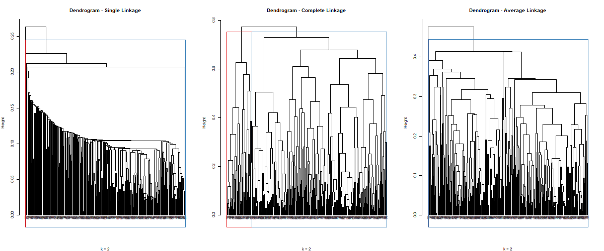
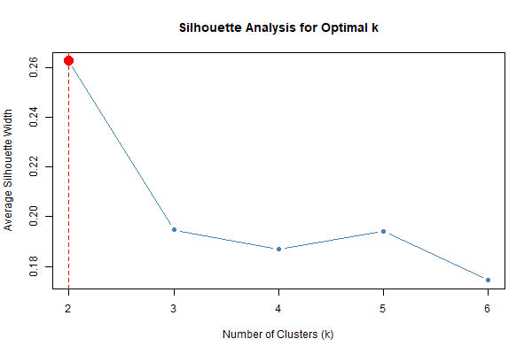
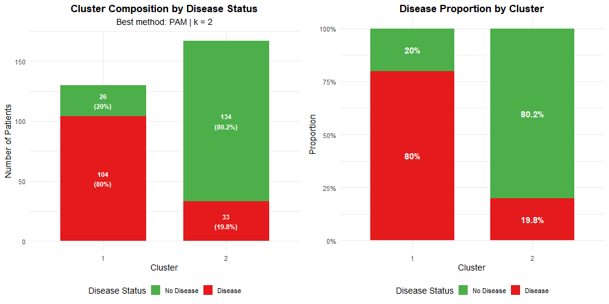

# Clustering Analysis Results

## Heart Disease Dataset

---

## 1. Data Overview

| Metric | Value |
|--------|-------|
| **Observations** | 297 |
| **Variables used** | 13 (excluding target variables `num` and `disease`) |
| **Variable types** | 6 quantitative + 7 categorical |

---

## 2. Distance Calculation

**Method**: Gower's Distance (`cluster::daisy`)

| Statistic | Value |
|-----------|-------|
| Minimum | 0.0053 |
| Maximum | 0.7732 |
| Mean | 0.3576 |

> Gower's distance was chosen because it handles mixed data types (quantitative + categorical) by applying appropriate distance measures for each variable type.

---

## 3. Hierarchical Clustering - Dendrogram Analysis

### Observations by Linkage Method

| Method | Shape | Cluster Split (k=2) | Behavior |
|--------|-------|---------------------|----------|
| **Single** | Elongated, "stringy" | 296 / 1 | Chaining effect — isolates single outlier |
| **Complete** | Balanced branching | 47 / 250 | Produces compact, separated clusters |
| **Average** | Similar to single | 296 / 1 | Also exhibits chaining effect |

### Key Findings

- **Single and average linkage** suffer from the **chaining effect**, producing degenerate clusters that merely isolate the most distant observation
- **Complete linkage** shows more meaningful structure, with a clear branching point around height ~0.55
- The 47/250 split from complete linkage, while unbalanced, represents a genuine subgroup in the data

---

## 4. Optimal Number of Clusters

**Method**: Silhouette Analysis

| k | Average Silhouette Width |
|---|--------------------------|
| 2 | **0.2628** (optimal) |
| 3 | 0.1947 |
| 4 | 0.1869 |
| 5 | 0.1942 |
| 6 | 0.1744 |

> **Optimal k = 2**. Silhouette scores decrease monotonically as k increases, suggesting the data does not have strong multi-cluster structure beyond a basic 2-group split.

---

## 5. Clustering Methods Comparison

| Method | Avg Silhouette | Cluster Sizes | Notes |
|--------|----------------|---------------|-------|
| **PAM** | **0.2628** | 130 / 167 | Best overall; balanced clusters |
| Single (HC) | 0.2320 | 296 / 1 | Artificially high (outlier isolation) |
| Average (HC) | 0.2320 | 296 / 1 | Same issue as single |
| Complete (HC) | 0.1533 | 47 / 250 | Meaningful but unbalanced |
| K-Prototypes | 0.0413 | 116 / 181 | Low silhouette (distance mismatch) |

### Winner: PAM (Partitioning Around Medoids)

- Produces **balanced clusters** (130 vs 167)
- Highest silhouette when comparing meaningful solutions
- Medoids are interpretable real observations

---

## 6. Silhouette Quality Assessment

All silhouette scores fall below 0.3, indicating **weak cluster structure**:

| Score Range | Interpretation | Our Results |
|-------------|----------------|-------------|
| 0.71 – 1.00 | Strong structure | — |
| 0.51 – 0.70 | Reasonable structure | — |
| 0.26 – 0.50 | Weak structure | PAM (0.26) |
| ≤ 0.25 | No substantial structure | Most methods |

> This is **common for medical data** where patient groups naturally overlap. The clusters represent tendencies, not discrete categories.

---

## 7. PAM Cluster Profiles (Medoids)

The two medoids (cluster representatives) show distinct clinical profiles:

| Feature | Cluster 1 (Medoid) | Cluster 2 (Medoid) |
|---------|-------------------|-------------------|
| **Age** | 60 | 50 |
| **Sex** | Male | Male |
| **Chest Pain** | Asymptomatic | Non-Anginal Pain |
| **Resting BP** | 125 | 129 |
| **Cholesterol** | 258 | 196 |
| **Max Heart Rate** | 141 | 163 |
| **Exercise Angina** | Yes | No |
| **ST Depression** | 2.8 | 0.0 |
| **ST Slope** | Flat | Upsloping |
| **Major Vessels** | 1 | 0 |
| **Thalassemia** | Reversible Defect | Normal |

### Clinical Interpretation

- **Cluster 1**: Higher risk profile (older age, asymptomatic presentation, high ST depression, exercise-induced angina, flat ST slope)
- **Cluster 2**: Lower risk profile (younger, normal thalassemia, no exercise angina, upsloping ST slope)

---

## 8. External Validation (Clusters vs Disease Status)

Cross-tabulating PAM clusters with the actual disease outcome validates that the clustering captures clinically meaningful groups.

### Cross-Tabulation

| Cluster | No Disease | Disease | Total |
|---------|------------|---------|-------|
| **1** | 26 | 104 | 130 |
| **2** | 134 | 33 | 167 |

### Proportions Within Each Cluster

| Cluster | No Disease | Disease |
|---------|------------|---------|
| **1** | 20.0% | **80.0%** |
| **2** | **80.2%** | 19.8% |

### Interpretation

The clustering shows **strong alignment with actual disease status**:

- **Cluster 1** is predominantly diseased patients (80%)
- **Cluster 2** is predominantly healthy patients (80%)

This confirms that the unsupervised clustering, based purely on clinical features (without using the diagnosis), successfully identified patient groups that correspond to disease presence.

> Despite the weak silhouette score (0.26), the external validation demonstrates that the clusters have **clinical validity**.

---

## 9. Next Steps
- [ ] Cluster profiling: Detailed variable-by-variable comparison

